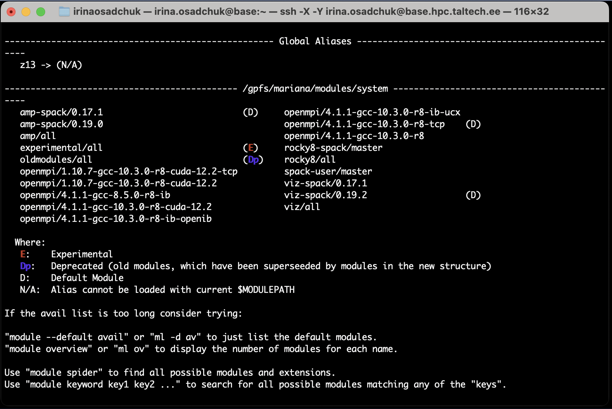
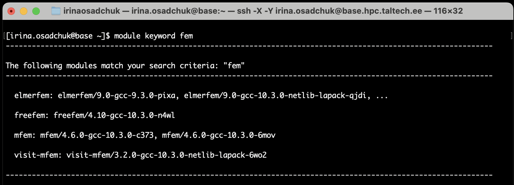

# Module environment (lmod)

## Short introduction

HPC has a module step-system. To use some application, user needs to follow these two steps, and insert applications into the search path:

1. Determine the machine type (eg. amp or green) by command:

    `module load rocky8-spack`      (for most free programs (SPACK package manager))
    
    or
    
    `module load rocky8/all`        (for licensed programs and some free (non-SPACK managed))


    if you want all modules available without having to load the rocky8-spack and rocky8 modules, you can add the above commands to your `$HOME/.bashrc`.
    

2. Load program needed:

    `module load tau`

The list of avalible modules can be looked by: `module avail`
       
where:  
<span style="color:red">
_**Lic** </span>  - a license is required, see user-guide for more information_  
<span style="color:red">
_**Uni** </span>  - commercial software with site licence, number of concurrent processes may be limited_  
<span style="color:red"> 
_**Reg** </span>  - registration required, see user-guide for more information_  
<span style="color:orange">
_**L**   </span> -  module is loaded_
<span style="color:blue">  
_**Dp**  </span> - deprecated (old modules, which have been superseeded by modules in the new structure)_
<span style="color:blue">  
_**O**   </span> - obsolete (module moved or superseeded by SPACK module)_  
<span style="color:blue">
_**Exp**   </span> - Experimental module, used while testing software installation, module name may change or software may be deleted_  
_**D** - default Module._

## Long version

The module system is used to manage settings for different applications. Many applications and libraries are not in the standard search path, this way it is possible to install two different versions of the same software/library that would otherwise create conflicts. The module system is used to insert applications into the search path (or remove them from it) on a per user and per occasion basis.

### Useful commands

 - All available modules can be looked through by command:

    `module avail`

    example output:

    {: style="width:95%; height:!95%;"}
        

    Modules are grouped in a hierarchy, there may be several versions of the same software installed, e.g. of the MPI library. Only one of these can be loaded at a single time. The default module of a group is marked by the `(D)`, if there is only one module in a group this is the default (unmarked).

 - To load a certain version of a module/program _(here - Open MPI 4.1.1-gcc-8.5.0-r8-ib)_:

    `module load openmpi/4.1.1-gcc-8.5.0-r8-ib`

    To load the default module/program marked `(D)` _(here - Open MPI 4.1.1-gcc-10.3.0-r8-tcp)_:

    `module load openmpi/`

 - To list all loaded modules

    `module list`

 - Unloading a module _(here - Cuda 11.3.1-gcc-10.3.0-ehi3)_:

    `module unload cuda/11.3.1-gcc-10.3.0-ehi3`

 -  Finding a module containing a certain part _(here - fem)_:

    `module keyword fem`

    Will be listed all modules that have _"fem"_ in the description:


    {: style="width:95%; height:!95%;"}


 - To find out more about a specific module _(here - mfem)_:

    `module spider mfem`

    gives

    {: style="width:95%; height:!95%;"}

 - The `module whatis` command gives you a short explanation what the software is about, e.g.

    {: style="width:95%; height:!95%;"}

    or

    {: style="width:95%; height:!95%;"}


###  Files .modulerc.lua and .bashrc

Personal preferences and resources can be specified in the files `.modulerc.lua` and  `.bashrc` in the user's `$HOME` directory. For example, it is possible to add a path for own module files for software installed by the user in the user's `$HOME` directory, 
automatically load some modules on login and to define one's own "default" modules using the entry "module_version("r/4.1.1-gcc-10.3.0-zwgc","default")" or introduce abbreviations using an entry like "module_alias("z13", "r/4.1.1-gcc-10.3.0-zwgc")" to define a module alias "z13".

Example of `.modulerc.lua` file

    module_version("r/4.1.1-gcc-10.3.0-zwgc","default")
    module_alias("z13","r/4.1.1-gcc-10.3.0-zwgc")

    module_version("p/20.2-gcc-10.3.0-python-2.7.18-ij2m","default")
    module_alias("p20","p/20.2-gcc-10.3.0-python-2.7.18-ij2m")
    
Example of `.bashrc` file
    
    # .bashrc

    # Source global definitions
    if [ -f /etc/bashrc ]; then
        . /etc/bashrc
    fi

    # Uncomment the following line if you don't like systemctl's auto-paging feature:
    # export SYSTEMD_PAGER=

    # User specific aliases and functions
    module load rocky8-spack
    module load r/4.1.1-gcc-10.3.0-zwgc

## Module groups


!!! info
    We moved to a new module structure! Modules from `/share/apps/modules` are being retired. Software is compiled for `x86-64` and will run o all nodes (no special optimization). Optimized versions for some software for specific nodes may follow later (or not).

New modules are grouped, you can activate them by loading one or more of the following modules:

| modulegroup | description |
|-------------|-------------|
| rocky8/all   | manually installed software |
| rocky8-spack | software installed with spack package manager |


## Modules used on **viz**

In order to make the module system work on **viz**, the following needs to be added to your `$HOME/.bashrc`


    if  [[ $(hostname -s) = viz ]]; then
       source /usr/share/lmod/6.6/init/bash
       module use /gpfs/mariana/modules/system
    fi

Further access to **viz** and load modules needed. For example:

    ssh -X -A -J UNI-ID@base.hpc.taltech.ee   UNI-ID@viz.hpc.taltech.ee

    module load viz-spack
    module load jmol

More about use of **viz** can be found at [visualization page](/visualization.html).

## Available modules

Currently the following modules are available, this serves as an example, please note that the list on this page will be updated very seldom, use `module avail` after login to get an up-to-date list of the availabe modules.


??? note "`module avail` output"
    ```
    ---------------------- /gpfs/mariana/modules/rocky8/all -----------------------
    abaqus/2018                       (Uni)
    abaqus/2021                       (Uni,D)
    abcl/1.9.2
    ansys-autodyn/23.2                (Lic,E)
    ansys-fluids/23.2
    gaussian/09
    gaussian/16.c01
    gaussian/16.c02
    gaussian/16                       (D)
    gaussview/6.1
    lsdyna/intel-mpp-13.0.0-d         (Lic)
    lsdyna/intel-mpp-13.0.0-s         (Lic)
    lsdyna/smp-13.0.0-d               (Lic)
    lsdyna/smp-13.0.0-s               (Lic,D)
    matlab/2014b                      (Uni)
    matlab/2018a                      (Uni)
    matlab/2021b                      (Uni)
    matlab/2022b                      (Uni)
    matlab/2023b                      (Uni,D)
    orca/4.1.2-lic
    orca/4.1.2
    orca/5.0.4                        (D)
    sbcl/2.2.2                        (L)
    star-ccm+/15.06.007-r8            (Lic)
    star-ccm+/15.06.008-r8            (Lic)
    star-ccm+/16.04.007-r8
    star-ccm+/16.04.012-r8            (Lic)
    star-ccm+/17.02.008-r8            (Lic)
    star-ccm+/17.04.008-r8-cad-nx-con (Lic)
    star-ccm+/17.04.008-r8            (Lic)
    star-ccm+/17.06.007-r8            (Lic)
    star-ccm+/18.04.008-r8            (Lic)
    star-ccm+/18.04.009-r8            (Lic,D)
    stda/1.6.3
    vmd/1.9.3-text                    (Reg,L)


    ----------------- /gpfs/mariana/modules/rocky8/rocky8-x86_64 ------------------
    bcftools/1.19-gcc-10.3.0-openblas-2nph
    bioawk/1.0-gcc-10.3.0-xzhf
    chapel/1.24.1-gcc-10.3.0-kryx
    cmake/3.29.2-gcc-10.3.0-jsyg
    cuda/11.3.1-gcc-10.3.0-ehi3
    cuda/12.2.2-gcc-10.3.0-5rec                                 (D)
    curl/8.7.1-gcc-10.3.0-xdf5                                  (L)
    elmerfem/9.0-gcc-10.3.0-4uqn
    fastqc/0.12.1-gcc-10.3.0-56yh
    fftw/3.3.10-gcc-10.3.0-ccxe
    freefem/4.10-gcc-10.3.0-n4wl
    gawk/5.3.0-gcc-8.5.0-a7a3
    gcc/10.3.0-gcc-8.5.0-abqv                                   (L)
    git/2.45.1-gcc-10.3.0-5xxc
    glib/2.78.3-gcc-10.3.0-on3e
    gnuplot/6.0.0-gcc-10.3.0-lysd
    gperf/3.1-gcc-10.3.0-ogys
    gromacs/2024.2-gcc-10.3.0-gqvn
    hdf5/1.14.3-gcc-10.3.0-pkxk
    hypre/2.31.0-gcc-10.3.0-kpoh
    jmol/14.31.0-gcc-10.3.0-wajs
    julia/1.10.2-gcc-10.3.0-openblas-a6d4
    libcatalyst/2.0.0-gcc-10.3.0-openblas-vpu7
    libfabric/1.18.0-gcc-10.3.0-qtmt
    lmod/8.7.37-gcc-10.3.0-nprc
    mawk/1.3.4-20240123-gcc-10.3.0-dw6a
    mercurial/6.7.3-gcc-10.3.0-python-3.9.7-sqxv
    mfem/4.6.0-gcc-10.3.0-c373
    mfem/4.6.0-gcc-10.3.0-6mov                                  (D)
    miniconda3/24.3.0-gcc-10.3.0-343s
    molden/6.7-gcc-10.3.0-5ln6
    netcdf-c/4.9.2-gcc-10.3.0-ergk
    netcdf-fortran/4.6.1-gcc-10.3.0-24g7
    netlib-lapack/3.11.0-gcc-10.3.0-5j7d
    netlib-scalapack/2.2.0-gcc-10.3.0-nvhpc-openmpi-frty
    nvhpc/22.9-gcc-10.3.0-c6t2
    nvtop/3.0.1-gcc-10.3.0-pure
    nvtop/3.0.1-gcc-10.3.0-v7ne
    nvtop/3.0.1-gcc-10.3.0-zq2a                                 (D)
    nwchem/7.2.2-gcc-10.3.0-netlib-lapack-klio
    octave-symbolic/2.9.0-gcc-10.3.0-netlib-lapack-24iy
    octave/9.1.0-gcc-10.3.0-netlib-lapack-tjlh
    openblas/0.3.26-gcc-10.3.0-khv7                             (L)
    openfoam-org/5.0-gcc-10.3.0-sblp
    openfoam-org/10-gcc-10.3.0-jhub                             (D)
    openfoam/1912_220610-gcc-10.3.0-j6wc
    openfoam/2106_220610-gcc-10.3.0-2jnl
    openfoam/2312-gcc-10.3.0-gclj                               (L,D)
    openrasmol/2.7.5.2-gcc-10.3.0-rnlx
    paraview/5.9.1-gcc-10.3.0-openblas-464b                     (L)
    petsc/3.21.1-gcc-10.3.0-netlib-lapack-lqid
    picard/3.1.1-gcc-10.3.0-madg
    py-anyio/3.6.2-gcc-10.3.0-python-3.9.7-bugc
    py-argon2-cffi-bindings/21.2.0-gcc-10.3.0-python-3.9.7-ir5u
    py-argon2-cffi/21.3.0-gcc-10.3.0-python-3.9.7-e3q4
    py-asttokens/2.4.0-gcc-10.3.0-python-3.9.7-7l43
    py-attrs/23.1.0-gcc-10.3.0-python-3.9.7-lytk
    py-babel/2.12.1-gcc-10.3.0-python-3.9.7-6e4r
    py-backcall/0.2.0-gcc-10.3.0-python-3.9.7-omya
    py-beautifulsoup4/4.12.2-gcc-10.3.0-python-3.9.7-3mbk
    py-bleach/6.0.0-gcc-10.3.0-python-3.9.7-jkow
    py-certifi/2023.7.22-gcc-10.3.0-python-3.9.7-u4vk
    py-cffi/1.15.1-gcc-10.3.0-python-3.9.7-njeq
    py-charset-normalizer/3.3.0-gcc-10.3.0-python-3.9.7-ahmd
    py-comm/0.1.4-gcc-10.3.0-python-3.9.7-tbis
    py-contourpy/1.0.7-gcc-10.3.0-openblas-nf6f
    py-cycler/0.11.0-gcc-10.3.0-python-3.9.7-5qo2
    py-debugpy/1.6.7-gcc-10.3.0-python-3.9.7-ixy4
    py-decorator/5.1.1-gcc-10.3.0-python-3.9.7-6o6k
    py-defusedxml/0.7.1-gcc-10.3.0-python-3.9.7-etbf
    py-executing/1.2.0-gcc-10.3.0-python-3.9.7-jb5a
    py-fastjsonschema/2.16.3-gcc-10.3.0-python-3.9.7-2tkd
    py-fonttools/4.39.4-gcc-10.3.0-python-3.9.7-zbrq
    py-gevent/23.7.0-gcc-10.3.0-python-3.9.7-ywdo
    py-greenlet/2.0.2-gcc-10.3.0-python-3.9.7-g3wh
    py-idna/3.4-gcc-10.3.0-python-3.9.7-xfuj
    py-importlib-metadata/7.0.1-gcc-10.3.0-python-3.9.7-phev
    py-importlib-resources/5.12.0-gcc-10.3.0-python-3.9.7-zc5z
    py-ipykernel/6.23.1-gcc-10.3.0-openblas-ejda
    py-ipython-genutils/0.2.0-gcc-10.3.0-python-3.9.7-7tjr
    py-ipython/8.14.0-gcc-10.3.0-openblas-cevj
    py-jedi/0.18.2-gcc-10.3.0-python-3.9.7-owt3
    py-jinja2/3.1.2-gcc-10.3.0-python-3.9.7-ejri
    py-json5/0.9.14-gcc-10.3.0-python-3.9.7-setp
    py-jsonschema/4.17.3-gcc-10.3.0-python-3.9.7-5bd3
    py-jupyter-client/8.2.0-gcc-10.3.0-python-3.9.7-wexx
    py-jupyter-core/5.3.0-gcc-10.3.0-python-3.9.7-wld5
    py-jupyter-server/1.21.0-gcc-10.3.0-python-3.9.7-b25c
    py-jupyterlab-pygments/0.2.2-gcc-10.3.0-python-3.9.7-kttz
    py-jupyterlab-server/2.22.1-gcc-10.3.0-python-3.9.7-ryk3
    py-jupyterlab/3.4.2-gcc-10.3.0-openblas-xsvk
    py-kiwisolver/1.4.5-gcc-10.3.0-python-3.9.7-yygr
    py-markupsafe/2.1.3-gcc-10.3.0-python-3.9.7-bpul
    py-matplotlib-inline/0.1.6-gcc-10.3.0-openblas-o5z6
    py-matplotlib/3.8.4-gcc-10.3.0-openblas-6vmn
    py-mistune/2.0.5-gcc-10.3.0-python-3.9.7-eid7
    py-nbclassic/0.4.8-gcc-10.3.0-openblas-zx6b
    py-nbclient/0.8.0-gcc-10.3.0-python-3.9.7-b7xq
    py-nbconvert/7.14.1-gcc-10.3.0-python-3.9.7-hxvg
    py-nbconvert/7.14.1-gcc-10.3.0-python-3.9.7-y6ii            (D)
    py-nbformat/5.8.0-gcc-10.3.0-python-3.9.7-74ab
    py-nest-asyncio/1.5.6-gcc-10.3.0-python-3.9.7-4hdc
    py-notebook-shim/0.2.3-gcc-10.3.0-python-3.9.7-w5cs
    py-numpy/1.21.6-gcc-10.3.0-openblas-kaao
    py-packaging/23.1-gcc-10.3.0-python-3.9.7-bzma
    py-pandocfilters/1.5.0-gcc-10.3.0-python-3.9.7-uitt
    py-parso/0.8.3-gcc-10.3.0-python-3.9.7-qxxb
    py-pexpect/4.8.0-gcc-10.3.0-python-3.9.7-wwkw
    py-pickleshare/0.7.5-gcc-10.3.0-python-3.9.7-xyrl
    py-pillow/10.3.0-gcc-10.3.0-python-3.9.7-spkd
    py-pip/23.1.2-gcc-10.3.0-python-3.9.7-pmrk
    py-platformdirs/3.10.0-gcc-10.3.0-python-3.9.7-7pms
    py-prometheus-client/0.17.0-gcc-10.3.0-python-3.9.7-ajdv
    py-prompt-toolkit/3.0.38-gcc-10.3.0-python-3.9.7-7733
    py-psutil/5.9.5-gcc-10.3.0-python-3.9.7-bxii
    py-ptyprocess/0.7.0-gcc-10.3.0-python-3.9.7-ubd4
    py-pure-eval/0.2.2-gcc-10.3.0-python-3.9.7-7e7k
    py-pybind11/2.12.0-gcc-10.3.0-python-3.9.7-yyzs
    py-pycparser/2.21-gcc-10.3.0-python-3.9.7-l633
    py-pygments/2.13.0-gcc-10.3.0-python-3.9.7-df5m
    py-pyparsing/3.1.2-gcc-10.3.0-python-3.9.7-ojnc
    py-pyrsistent/0.19.3-gcc-10.3.0-python-3.9.7-u6lp
    py-python-dateutil/2.8.2-gcc-10.3.0-python-3.9.7-uc6q
    py-pyzmq/25.0.2-gcc-10.3.0-python-3.9.7-vtzs
    py-requests/2.31.0-gcc-10.3.0-python-3.9.7-evis
    py-send2trash/1.8.0-gcc-10.3.0-python-3.9.7-bgvz
    py-setuptools/59.4.0-gcc-10.3.0-python-3.9.7-mjeg
    py-six/1.16.0-gcc-10.3.0-python-3.9.7-pz4t
    py-sniffio/1.3.0-gcc-10.3.0-python-3.9.7-opfj
    py-soupsieve/2.4.1-gcc-10.3.0-python-3.9.7-oanu
    py-stack-data/0.6.2-gcc-10.3.0-python-3.9.7-nkn4
    py-terminado/0.17.1-gcc-10.3.0-python-3.9.7-zfq4
    py-tinycss2/1.2.1-gcc-10.3.0-python-3.9.7-ddln
    py-tornado/6.3.3-gcc-10.3.0-python-3.9.7-c7p3
    py-traitlets/5.9.0-gcc-10.3.0-python-3.9.7-r677
    py-typing-extensions/4.8.0-gcc-10.3.0-python-3.9.7-ql62
    py-urllib3/2.1.0-gcc-10.3.0-python-3.9.7-edpr
    py-wcwidth/0.2.7-gcc-10.3.0-python-3.9.7-tcwk
    py-webencodings/0.5.1-gcc-10.3.0-python-3.9.7-b533
    py-websocket-client/1.6.3-gcc-10.3.0-python-3.9.7-5po6
    py-zipp/3.17.0-gcc-10.3.0-python-3.9.7-5b4u
    py-zope-event/4.6-gcc-10.3.0-python-3.9.7-ffgp
    py-zope-interface/5.4.0-gcc-10.3.0-python-3.9.7-2q5a
    python/3.9.7-gcc-10.3.0-kxnt                                (L)
    qwt/6.1.6-gcc-10.3.0-vimf
    r/4.4.0-gcc-10.3.0-netlib-lapack-mvzt
    samtools/1.19.2-gcc-10.3.0-6l26
    screen/4.9.1-gcc-10.3.0-rzjc
    sortmerna/2017-07-13-gcc-10.3.0-3nqh
    star/2.7.11b-gcc-10.3.0-26bs
    su2/8.0.1-gcc-10.3.0-xdk6
    tmux/3.4-gcc-10.3.0-5b7i
    trimmomatic/0.39-gcc-10.3.0-qwqr
    vcftools/0.1.16-gcc-10.3.0-r5ch

    ------------------------ /gpfs/mariana/modules/system -------------------------
    amp-spack/0.17.1                       (D)
    amp-spack/0.19.0
    amp/all
    experimental/all
    oldmodules/all                         (Dp)
    openmpi/1.10.7-gcc-10.3.0-r8-cuda-12.2
    openmpi/4.1.1-gcc-8.5.0-r8-ib
    openmpi/4.1.1-gcc-9.3-amp
    openmpi/4.1.1-gcc-9.3-amppmi
    openmpi/4.1.1-gcc-9.3-amppmicuda11.4
    openmpi/4.1.1-gcc-10.3.0-r8-cuda-12.2  (L)
    openmpi/4.1.1-gcc-10.3.0-r8-ib-openib
    openmpi/4.1.1-gcc-10.3.0-r8-ib-ucx
    openmpi/4.1.1-gcc-10.3.0-r8-tcp
    openmpi/4.1.1-gcc-10.3.0-r8            (D)
    rocky8-spack/master                    (L)
    rocky8/all
    viz-spack/0.17.1
    viz-spack/0.19.2                       (D)
    viz/all
    ```

By default SPACK builds optimized for the CPU the software is build on.
The packages from the **amp** nodes will work on the **green** nodes but slower than the optimized modules. Conversely, the skylake-optimized modules will try to use hardware features not present on the **green** nodes, so the software will not run there.

<!---
You can autoactivate the correct module path in your `.bashrc` with a code block like this:

    if [[ $(hostname -s) = base ]]; then
      module load green
      module load green-spack
    elif [[ $(hostname -s) = green* ]]; then
      module load green
      module load green-spack
    elif  [[ $(hostname -s) = gray* ]]; then
      module load gray
      module load gray-spack
    elif  [[ $(hostname -s) = mem1tb ]]; then
      module load gray
      module load gray-spack
    elif  [[ $(hostname -s) = amp* ]]; then
      module use /gpfs/mariana/modules/system
      module load amp
      module load amp-spack
    elif  [[ $(hostname -s) = viz ]]; then
      source /usr/share/lmod/6.6/init/bash
      module use /gpfs/mariana/modules/system
    fi
--->

<!--
### _SPACK for user build software_

SPACK can also be used by users to manage their own software stack inside their home directory (be aware, this takes a lot of space!).

see documentation on <https://spack.readthedocs.io/en/latest/>

SPACK includes GPU-offloading compiler for both Nvidia and AMD, profiling tools (Tau, HPCToolkit) and engineering simulation packages (ElmerFEM, OpenFOAM).

SPACK is used by University of Tartu, LRZ and HLRS.
-->

<!--
## Software modules from the EasyBuild package system

**under development, docs AND module positions/versions may change without notice**

EasyBuild is a package manager to install software packages. An advantage is to be able to relatively easily install consistent dependencies and multiple versions of a software. [List of packages](https://docs.easybuild.io/version-specific/supported-software/)


EasyBuild is available on **amp** from AI lab

    module load amp


### _EasyBuild for user build software_

EasyBuild can also be used by users to manage their own software stack inside their home directory (be aware, this takes a lot of space!).

See documentation on [https://docs.easybuild.io/en/latest/](https://docs.easybuild.io/en/latest/)


EasyBuild seems to be more AI and Python oriented.


EasyBuild is used by AI-lab and will be used on LUMI. On LUMI it is "bring your own build recipe (.eb file)"!
-->

<!--
Personal module collections

You can save a collection of loaded modules to a named collection with the save option.

$ module save <collection-name>

To restore a previously saved collection, you can restore the saved module collection with the restore option.

$ module restore <collection-name>

To list all available personal module collections, you can use the savelist option.

$ module savelist

To remove a specific saved module collection.

$ module disable <collection-name>
-->
