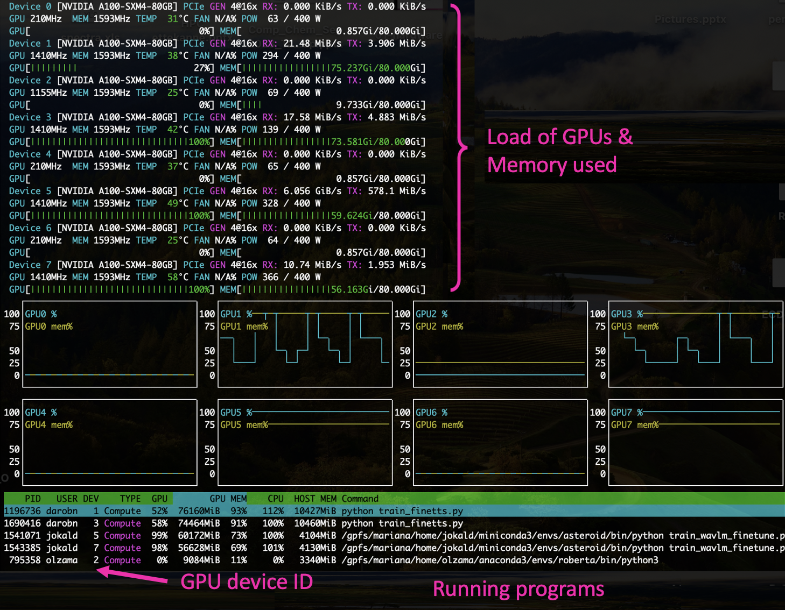

# Quickstart: Cluster

## Accessing the cluster

**NB! To access the cluster, user must have an active [Uni-ID account](https://taltech.atlassian.net/wiki/spaces/ITI/pages/38994346/Uni-ID+ehk+Digitaalne+identiteet).** For people who are neither students nor employees of Taltech [Uni-ID non-contractual account](https://taltech.atlassian.net/wiki/spaces/ITI/pages/38994346/Uni-ID+ehk+Digitaalne+identiteet#External-UNI-ID) should be created by the head of a structural unit.

**To get access to HPC contact us by email ([hpcsupport@taltech.ee](mailto:hpcsupport@taltech.ee)) or [Taltech portal](https://taltech.atlassian.net/servicedesk/customer/portal/18).** We need the following information: uni-ID, department, project that covers [costs](/index.html#billing).

**The cluster is accessible from inside the university** and from major **Estonian network** providers. If you are traveling (or not in one of the major networks), the access requires [FortiVPN](https://taltech.atlassian.net/wiki/spaces/ITI/pages/38994267/Kaug+hendus+FortiClient+VPN+Remote+connection+with+FortiClient+VPN) (for OnDemand session and `ssh` command).

To access the cluster **base.hpc.taltech.ee** via a browser with a graphical, menu-based environment use desktop session on [ondemand.hpc.taltech.ee](https://ondemand.hpc.taltech.ee)

{: style="width:85%; height:!75%;"}

[More about OnDemand sessions](/ondemand.html).

Another option is SSH (the Secure SHell), available by command `ssh` in **Linux/Unix, Mac** and **Windows-10.**  A PuTTY guide for Windows users (an alternative SSH using a graphical user interface (GUI)) is [here](/putty.html).

For using graphical applications add the `-X`, and for GLX (X Window System) forwarding additionally the `-Y` switch,:

```bash
ssh -X -Y uni-ID@base.hpc.taltech.ee
```

_**where uni-ID should be changed to user's uni-ID.**_

***NB!*** **The login-node is for some light interactive analysis.** For heavy computations, request a (interactive) session with the resource manager [SLURM](/quickstart.html#running-jobs-with-slurm) or submit job for execution by SLURM sbatch script!**

We strongly recommend to **use SSH-keys for logging** to the cluster with ssh command. [How to get SSH keys](/ssh.html).

## Structure and file tree 

By accessing the cluster, the user gets into home directory or `$HOME` (`/gpfs/mariana/home/$USER/`).

In the home directory, the user can create, delete, and overwrite files and perform calculations (if slurm script does not force program to use ` $SCRATCH ` directory). The home directory is limited in size of 500 GB and backups are performed once per week.

The home directory can be accessed from console or by GUI programs, but it cannot be mounted. For mounting was created special `smbhome` and `smbgroup` folders (`/gpfs/mariana/smbhome/$USER/` and `/gpfs/mariana/smbgroup/`, respectively). More about `smb` folders can be found [here](/quickstart.html#smbcifs-exported-filesystems).

Some programs and scripts suppose that files will be transfer to `$SCRATCH` directory at compute node and calculations will be done there. If job will be killed, for example due  to the time limit back transfer will not occur. In this case, user needs to know at which node this job was running (see `slurm-$job_id.stat`), to connect to exactly this node (in example it is green11). `$SCRATCH` directory will be in `/state/partition1/` and corresponds to jobID number.

```bash
srun -w green11 --pty bash
cd /state/partition1/
```

Please note that the scratch is *not* shared between nodes, so parallel MPI jobs that span multiple nodes cannot access each other's scratch files.

## Running jobs with SLURM 

SLURM is a management and job scheduling system at Linux clusters. More about [SLURM quick references](https://slurm.schedmd.com/pdfs/summary.pdf).

Examples of slurm scripts are usually given at the program's page with some recommendations for optimal use of resources for this particular program. List of the programs installed at HPC is given at our [software page](/software.html).

The most often used SLURM commands are:

- `srun` - to start a session or an application (in real time)
- `sbatch` - to start a computation using a batch file (submit for later execution)
- `squeue` - to check the load of the cluster and status of jobs
- `sinfo` - to check the state of the cluster and partitions
- `scancel` - to delete a submitted job (or stop a running one).

For more parameters see the man-pages (manual) of the commands `srun`, `sbatch`, `sinfo` and `squeue`. For example:

```bash
man srun
```

Requesting resources with SLURM can be done either with parameters to `srun` or in a batch script invoked by `#SBATCH`. Unless otherwise specified, 1GB/thread will be used and the job will run for 10 minutes. [More about partitions and their limits](/index.html#slurm-partitions).

**Running an interactive session** longer than default 10 min. (here 1 hour):

```bash
srun -t 01:00:00 --pty bash 
```

This logs you into one of the compute nodes, there you can load modules and run interactive applications, compile your code, etc.

With `srun` is reccomended to use CLI (command-line interface) instead of GUI (Graphical user interface) programs if it is possible. For example, use octave-CLI or octave instead of octave-GUI.

**Running a simple non-interactive single process job** that lasts longer than default 4 hours (here 5 hours):

```bash
srun --partition=common -t 05:00:00 -n 1 ./a.out
```

***NB!*** *Environment variables for OpenMP are *not* set automatically, e.g.*

```bash
srun  -N 1 --cpus-per-task=28 ./a.out
```

would *not* set `OMP_NUM_THREADS` to 28, this has to be done manually. So usually, for parallel jobs it is recommended to use scripts for `sbatch`. 

Below is given **an example of batch slurm script** (filename: `myjob.slurm`) with explanation of the commands. 

```bash
#!/bin/bash
#SBATCH --partition=common    ### Partition
#SBATCH --job-name=HelloOMP   ### Job Name           -J
#SBATCH --time=00:10:00       ### Time limit         -t
#SBATCH --nodes=4             ### Number of Nodes    -N 
#SBATCH --ntasks-per-node=7   ### Number of tasks (MPI processes)
#SBATCH --cpus-per-task=4     ### Number of threads per task (OMP threads)
#SBATCH --account=ptoject     ### Essentially your research group
#SBATCH --mem-per-cpu=100     ### Min RAM required in MB
#SBATCH --array=13-18         ### Array tasks for parameter sweep
    
    export OMP_NUM_THREADS=$SLURM_CPUS_PER_TASK    	### setup environment
    module load gcc    					### setup environment
    ./hello_omp $SLURM_ARRAY_TASK_ID    		### only for arrays, setup output files with system information

    srun -n 28 ./hello_mpi     			### run program
```


In this example are listed some of the most common submission parameters. There are many other possible options, moreover, some of the options listed above  are not useful to apply together. Here can be found descriptions of the [variables used inside SLURM/SBATCH](https://slurm.schedmd.com/sbatch.html#lbAJ) and **[more examples of SLURM scripts](/slurm_example.html)** with more detailed explanations.


The job is then submitted to SLURM by

```bash
sbatch myjob.slurm
```

and will be executed when the requested resources become available.

Output of applications and error messages are by default written to a `slurm-$job_id.out` file. [More about SLURM finished job statistics](/slurm_statistics.html).

## SLURM accounts  

In SLURM exist accounts for billing, these are different from the login account!

Each user has his/her own personal SLURM-account, which will have a small monthly limit.  For larger calculations user should have at least one project account. SLURM user-accounts start with `user_` and project accounts with `project_` and course accounts with `course_`, followed by uniID/projectID/courseID.

You can check which SLURM accounts you belong to, by:

```bash
sacctmgr show associations format=account%30,user%30 | grep $USER
```

Currently (almost) all users belong to the SLURM-account "vaikimisi" (default), it is possible to submit jobs under this account, especially if no `user_` or project account has been created for you yet, however, "vaikimisi" will be discontinued in the near future.

When submitting a job, **it is important to use the correct SLURM-account** `--account=SLURM-ACCOUNT`, as this is connected to the financial source.

## Monitoring jobs & resources

### Monitoring a job on the node

#### Status of a job

User can check the status his jobs (whether they are running or not, and on which node) by the command:

```bash
squeue -u $USER
```


#### Load of the node

User can check the load of the node his job runs on, status and configuration of this node by command

```bash
scontrol show node <nodename>
```

the load should not exceed the number of hyperthreads (CPUs in SLURM notation) of the node.


In case of MPI parallel runs statistics of several nodes can be monitored by specifying nodes names. For example:  

```bash
scontrol show node=green[25-26]
```


Node features for node selection using `--constraint=`:

| feature | what it is |
|----------|-----------|
| A100-40 | has A100 GPU with 40GB |
| A100-80 | has A100 GPU with 80GB |
| L40 | has L40 GPU with 48GB |
| nvcc80 | GPU has compute capability 8.0 (A100, L40) |
| nvcc89 | GPU has compute capability 8.9  (L40) |
| nvcc35 | GPU has compute capability 3.5 (K20Xm, A100, L40) |
| zen2 | AMD Zen CPU architecture 2nd generation (amp1) |
| zen3 | AMD Zen CPU architecture 3rd generation (amp2) |
| zen4 | AMD Zen CPU architecture 4th generation (ada*) |
| avx512 | CPU has avx512 (skylake, zen4) |
| skylake | Intel SkyLake CPU architecture (green*) |
| sandybridge | Intel SandyBridge CPU architecture (mem1tb, viz) |
| ib | InfiniBand network interface |


#### Monitoring with interactive job

It is possible to submit a second interactive job to the node where the main job is running, check with `squeue` where your job is running, then submit

```bash
srun -w <nodename> --pty htop
```

Note that there must be free slots on the machine, so if you cannot use `-n 80` or `--exclusive` for your main job (use `-n 79`).


Press `q` to exit.

??? info "You can also add a column that shows the CPU number of the program"
    For Linux **F1-F10** keys should be used, for **Mac** - just click on the corresponding buttons.

    

    Will appear a new column, showing the CPU number of the program.

    

#### Monitoring jobs using GPUs

Log to **amp** or **amp2**. Command:

```bash
echo ${SLURM_STEP_GPUS:-$SLURM_JOB_GPUS} 
```

shows the GPU IDs allocated to your job.

GPUs load can be checked by command:

```bash
nvidia-smi
```


Press `control+c` to exit.

Another option is to logging to **amp** or **amp2**, check which GPUs are allocated to your job, and give command:

```bash
nvtop
```



Press `q` to exit.

An alternative method **on Linux computers,** if you have X11. Logging to **base/amp** with `--X` key:

```bash
ssh --X UniID@base.hpc.taltech.ee
```

then submit your main interactive job 

```bash
srun --x11 -n <numtasks> --cpus-per-task=<numthreads> --pty bash
```

and start an `xterm -e htop &` in the session.

In `sbatch` the option `--x11=batch` can be used, note that the ssh session to **base** needs to stay open!


### Monitoring resource usage

Default disc quota for `home` (that is backed up weekly) is 500 GB and for `smbhome` (that is not backed up) -- 2 TB per user. For `smbgroup` there is no limits and no backup.

The easiest way to check your current disk usage is to look at the table that appears when you log in to HPC.


You can also monitor your resource usage by `taltech-lsquota.bash` script and `sreport` command.

Current disk usage:

```bash
taltech-lsquota.bash
```


CPU usage during last day:

```bash
sreport -t Hours cluster UserUtilizationByAccount Users=$USER
```


CPU usage in specific period (e.g. since beginning of this year):

```bash
sreport -t Hours cluster UserUtilizationByAccount Users=$USER start=2024-01-01T00:00:00 end=2024-12-31T23:59:59
```

Where `start=` and `end=` can be changed depending on the desired period of time. 


For convenience, a tool `taltech-history` was created, by default it shows the jobs of the current month, use `taltech-history -a` to get a summary of the useh hours and costs of the current month.

## Copying data to/from the clusters

Since HPC disk quota is limited, it is recommended to have your own copy of important calculations and results. Data from HPC can be transferred by several commands: `scp`, `sftp`, `sshfs` or `rsync`.

1. `scp` is available on all **Linux systems,** **Mac** and **Windows10 PowerShell.** There are also GUI versions available for different OS (like [PuTTY](/putty.html)).

    Copying ***to*** the cluster with `scp`:
    
    `scp local_path_from_where_copy/file uni-id@base.hpc.taltech.ee:path_where_to_save`
    
    

    Copying ***from*** the cluster with `scp`:
    
    `scp uni-id@base.hpc.taltech.ee:path_from_where_copy/file local_path_where_to_save`
    
    
    
    Path to the file at HPC can be checked by  `pwd` command.

       
2. `sftp` is the secure version of the `ftp` protocol vailable on **Linux,** **Mac** and **Windows10 PowerShell.** This command starts a session, in which files can be transmitted in both directions using the `get` and `put` commands. File transfer can be done in "binary" or "ascii" mode, conversion of line-endings (see below) is automatic in "ascii" mode. There are also GUI versions available for different OS ([FileZilla](https://filezilla-project.org/), [gFTP](https://github.com/masneyb/gftp) and [WinSCP](https://winscp.net/eng/index.php) (Windows))

    `sftp uni-id@base.hpc.taltech.ee`

    

3.  `sshfs` can be used to temporarily mount remote filesystems for data transfer or analysis. Available in **Linux.** The data is tunneled through an ssh-connection. Be sware that this is usually not performant and can creates high load on the login node due to ssh-encryption.

    `sshfs uni-id@base.hpc.taltech.ee:remote_dir/ /path_to_local_mount_point/`

4. `rsync` can update files if previous versions exist without having to transfer the whole file. However, its use is recommended **for the advanced user only** since one has to be careful with the syntax.

### SMB/CIFS exported filesystems

One of the simple and convenient ways to control and process data based on HPC is mounting. Mounting means that user attaches his directory placed at HPC to a directory on his computer and can process files as if they were on this computer. These can be accessed from within university or from [EduVPN](https://eduvpn.taltech.ee/vpn-user-portal/home).

Each user automatically has a directory within `smbhome`. It does not match with `$HOME` directory, so calculations should be initially done at `smbhome` directory to prevent copying or files needed should be copied from `home` directory to the `smbhome` directory by commands:

```bash
pwd    ### look path to the file 
cp path_to_your_file/your_file /gpfs/mariana/smbhome/$USER/    ### copying
```

To get a directory for group access, please contact us (a group and a directory need to be created).


The HPC center exports two filesystems as Windows network shares:

| local path on cluster | Linux network URL | Windows network URL |
|-----------------------|-------------------|---------------------|
|    /gpfs/mariana/smbhome/$USER | smb://smb.hpc.taltech.ee/smbhome | \\\\smb.hpc.taltech.ee\smbhome | 
|    /gpfs/mariana/smbgroup | smb://smb.hpc.taltech.ee/smbgroup | \\\\smb.hpc.taltech.ee\smbgroup |
|    /gpfs/mariana/home/$USER | not exported | not exported |


**This is the quick-access guide, for more details, see [here](/samba.html)**


#### Windows access

The shares can be found using the Explorer "Map Network Drive".

```
    server >>> \\smb.hpc.taltech.ee\smbhome
    username >>> INTRA\<uni-id>
```

From Powershell: 
```powershell
net use \\smb.hpc.taltech.ee\smbhome /user:INTRA\uni-id
get-smbconnection
```

#### Linux access

On Linux with GUI Desktop, the shares can be accessed with the nautilus browser.

From commandline, the shares can be mounted as follows:

```bash
    dbus-run-session bash
    gio mount smb://smb.hpc.taltech.ee/smbhome/
```

you will be asked for "User" (which is your UniID), "Domain" (which is "INTRA"), and your password.

To disconnect from the share, unmount with

```bash
    gio mount -u smb://smb.hpc.taltech.ee/smbhome/
```

### Special considerations for copying Windows - Linux

Microsoft Windows is using a different line ending in text files (ASCII/UTF8 files) than Linux/Unix/Mac: CRLF vs. LF
When copying files between Windows-Linux, this needs to be taken into account. The FTP (File Transfer Protocol) has ASCII and BINARY modes, in ASCII-mode the line-end conversion is automatic.

There are tools for conversion of the line-ending, in case the file was copied without line conversion: `dos2unix`, `unix2dos`, `todos`, `fromdos`, the stream-editor `sed` can also be used.

## Backup

There are 2 major directories where users can store data:

- `/gpfs/mariana/home/` default home directory which is limited to 500GB and is backed up, excluding specific directories: `[*/envs/, */.cache/, */pkgs/, */vscode-server/, */.npm/, */.nvm/, */anaconda3/, */.local/]`.
- `/gpfs/mariana/smbhome/` has a limit of 2TB and is not backed up.

The home directory is meant for critical data like configurations and scripts, whereas smbhome is meant for data.

The backup will run weekly. *If the home directory is larger than 500GB [usage is displayed upon login to the cluster] it will not be backed up.*

If your home directory is larger than 500G please move the data to smbhome.

At HPC are installed programs with varying licence agreement. To use some licensed programs (for example, Gaussian), the user must be added to the appropriate group. For this contact us email ([hpcsupport@taltech.ee](mailto:hpcsupport@taltech.ee)) or [Taltech portal](https://portal.taltech.ee/v2). More about available programs and licenses can be found at [software page](/software.html).
