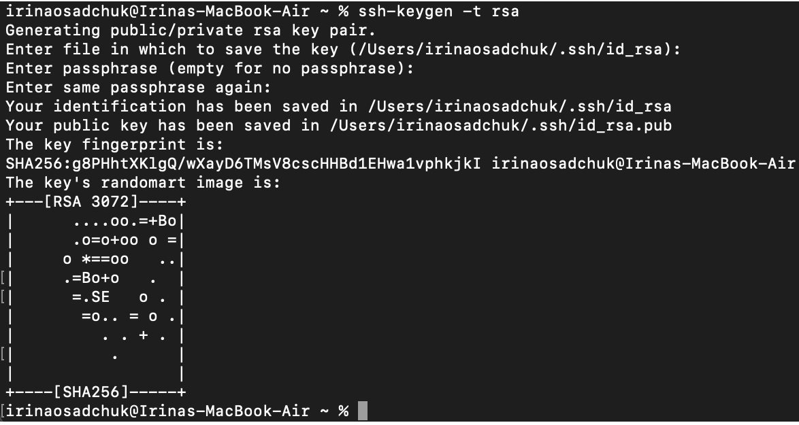
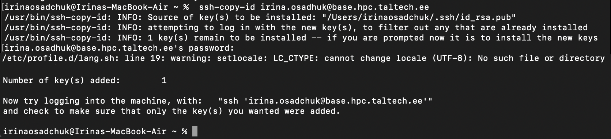

# Getting SSH keys to work

SSH key fingerprint is a security feature for easy identification/verification of the host, user is connecting to. This option allows to connect to the server without a password. On first connect, user is shown a fingerprint of a host-key, and asked if it should be added to the list of known hosts.

Please compare the fingerprint to the ones below, if one matches, the host can be added, if the fingerprint does not match, then there is a problem (e.g. man-in-the-middle-attack).

SSH host keys of our servers

**base.hpc.taltech.ee**
-   ECDSA SHA256:OEfQiOB/eIG8hYoQ25sQk9T5tx9EtQbhi6sNM4C8mME
-   ED25519 SHA256:t0CSTU0AnSsJThzuM68tucrcfnn2wLKabjSnuRKX8Yc
-   RSA SHA256:qYrmOw/YN7wf640yBHADX3wnAOPu0OOXlcu4LKBxzG8   

.  

**amp.hpc.taltech.ee**
-   ECDSA SHA256:yl6+VaKow6qDZAXL3rQY8+3d3pcH0kYg7MjGgNVTWZs
-   ED25519 SHA256:YOjtpcEL2+AWm6vDFjVl0znYuQPMSVCkyFGvdO5fm8o
-   RSA SHA256:4aaOxumH1ATNfiIA4mZSNMefvxfdFm5zZoUj6VR7TYo   

.   
  
**viz.hpc.taltech.ee**
-   ECDSA SHA256:z2/bxleZ3T3vErkg4C7kvDPKKEU0qaoR8bL29EgMfGA
-   ED25519 SHA256:9zRBmS3dxD7BNISZKwg6l/2+6p4HeqlOhA4OMBjD9mk
-   RSA SHA256:Q6NDm88foRVTKtEAEexcRqPqMQNGUzf3rQdetBympPg

 

## Generating  SSH keys 

---

In Linux and macOS SSH keys can be generated in cmd by command:
	
	ssh-keygen -t rsa
	
In Windows SSH keys can be generated in powershell by command:
	
	ssh-keygen.exe -t rsa
	
The program prompts the user through the process, just sets the location and asks the user to set a passphrase, which should be created. This process ends with two keys in the path it showed. One of them is named (by default) `id_rsa` and the other `id_rsa.pub`. The `.pub` key is your public key, the other is a private key. 

***NB! Never share your private key with anyone.***

More detail guides can be found here:

 - Linux - [https://linuxhint.com/generate-ssh-keys-on-linux/](https://linuxhint.com/generate-ssh-keys-on-linux/)
 - macOS - [https://docs.tritondatacenter.com/public-cloud/getting-started/ssh-keys/generating-an-ssh-key-manually/manually-generating-your-ssh-key-in-mac-os-x](https://docs.tritondatacenter.com/public-cloud/getting-started/ssh-keys/generating-an-ssh-key-manually/manually-generating-your-ssh-key-in-mac-os-x)
 - Windows - [https://phoenixnap.com/kb/generate-ssh-key-windows-10](https://phoenixnap.com/kb/generate-ssh-key-windows-10)

 
 
 

## Uploading SSH keys to base

---

Once the keys are created, the public (.pub) key needs to be uploaded to base. There are a couple of ways to do it. On base, SSH public keys are found in `/etc/AuthorizedKeys/$USER` file, there is a link to it from `.ssh/authorized_keys` file.

Several SSH keys can be used simultaneously to access the same user account in case of use several different devices. 

On Mac and Linux to copy keys to the cluster:

	ssh-copy-id Uni-ID@base.hpc.taltech.ee
	
	
	
On windows it can be copied in powershell with this command:

	type $env:USERPROFILE\.ssh\id_rsa.pub | ssh Uni-Id@base.hpc.taltech.ee "cat >> .ssh/authorized_keys"

A more thorough explanation with an example can be found [here](https://www.chrisjhart.com/Windows-10-ssh-copy-id/).

